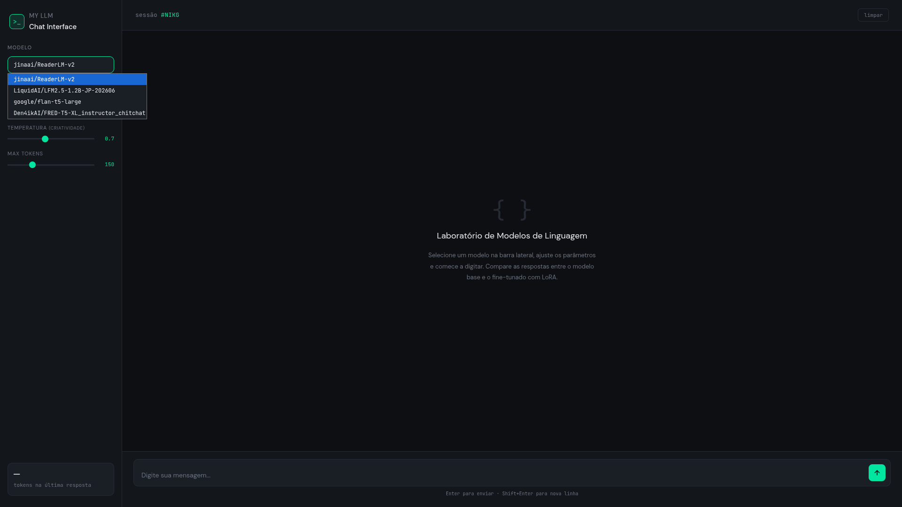

# 🤖 LLM_LORA_UNITY_II_UFRN


**Second Evaluation – Advanced Topics in Artificial Intelligence**
Federal University of Rio Grande do Norte (UFRN)

Developed under the supervision of **Prof. Dr. Thommas Kevin Sales Flores**.

---

## 📖 About the Project

This project presents the implementation and evaluation of four Large Language Models (LLMs) fine-tuned using the **LoRA (Low-Rank Adaptation)** technique.

The objective was to investigate the feasibility of deploying lightweight language models on consumer hardware, comparing **Causal** and **Seq2Seq** architectures through quantitative and qualitative analyses.

The project includes:

* Dataset generation using RAG techniques;
* Fine-tuning with LoRA;
* Model evaluation using automatic metrics;
* Deployment through a web interface built with FastAPI;
* Comparative discussion of the obtained results.

---

## 🛠 Technologies Used

* Python 3.x
* FastAPI
* Hugging Face Transformers
* LoRA (PEFT)
* PyTorch
* Jupyter Notebook
* HTML
* Retrieval-Augmented Generation (RAG)

---

## 📁 Project Structure

```text
LLM_LORA_UNITY_II_UFRN
│
├── .gitignore
├── README.md
├── requirements.txt
│
├── All models
│   ├── Main.py
│   └── static
│       └── index.html
│
├── model1
│   ├── RAG_llm.ipynb
│   ├── lora_finetuned_model.ipynb
│   ├── lora_medium.ipynb
│   └── avaliacao_modelo_finetuned.ipynb
│
├── model2
│   ├── lora_finetuned_model.ipynb
│   ├── lora_medium.ipynb
│   └── avaliacao_modelo_finetuned.ipynb
│
├── model3
│   ├── lora_finetuned_model.ipynb
│   ├── lora_medium.ipynb
│   └── avaliacao_modelo_finetuned.ipynb
│
└── model4
    ├── lora_finetuned_model.ipynb
    ├── lora_medium.ipynb
    └── avaliacao_modelo_finetuned.ipynb
```

---

## 🚀 Installation

### 1. Clone the Repository

```bash
git clone <https://github.com/JVEXEAR/LLM_LORA_UNITY_II_UFRN.git>
cd LLM_LORA_UNITY_II_UFRN
```

### 2. Create a Virtual Environment

```bash
python -m venv .venv
```

### 3. Activate the Environment

Linux/macOS:

```bash
source .venv/bin/activate
```

Windows (Command Prompt):

```cmd
.venv\Scripts\activate
```

---

## 📦 Installing Dependencies

Create a `requirements.txt` file containing:

```text
transformers
datasets
pypdf2
accelerate
sentencepiece
torch
pdfplumber
peft
fastapi
uvicorn
sacrebleu
rouge-score
nltk
pandas
matplotlib
seaborn
tqdm
```

Then install the dependencies:

```bash
pip install -r requirements.txt
```

---

## 💻 Recommended Development Environment

For a better experience, it is recommended to use:

* Visual Studio Code;
* Python Extension;
* Jupyter Extension.

---

## ⚙️ Workflow Execution

Execute the notebooks in the following order:

### Model 1

```text
RAG_llm.ipynb
↓
lora_medium.ipynb
↓
avaliacao_modelo_finetuned.ipynb
```

> **Note:** `RAG_llm.ipynb` exists only in Model 1 because it is responsible for generating the `dataset_gerado_500.jsonl` dataset.

### Models 2, 3 and 4

```text
lora_medium.ipynb
↓
avaliacao_modelo_finetuned.ipynb
```

---

## 🌐 Running the Web Interface

After executing the notebooks and starting the FastAPI application:

```bash
python Main.py
```

The interface will be available at:

```text
http://127.0.0.1:8000/
```

or

```text
http://0.0.0.0:8000/
```

### Panel:




---

## 🖼 Model Responses

### Causal Model 1


### Causal Model 2


### Seq2Seq Model 1


### Seq2Seq Model 2


---

## 📊 Evaluation Results

| Model     |    PPL |  BLEU | ROUGE-1 F1 | ROUGE-2 F1 | Faithfulness | ROUGE-L | Answer Relevance | Plan Adherence |
| :-------- | -----: | ----: | ---------: | ---------: | -----------: | ------: | ---------------: | -------------: |
| Causal 1  | 344.10 | 2.090 |      0.088 |      0.042 |        0.070 |   0.169 |            0.149 |          0.495 |
| Causal 2  |  54.38 | 2.000 |      0.085 |      0.028 |        0.074 |   0.077 |            0.038 |          0.495 |
| Seq2Seq 1 |  1.880 | 0.000 |      0.000 |      0.000 |        0.000 |   0.000 |            0.000 |          0.495 |
| Seq2Seq 2 |  1.440 | 4.600 |      0.321 |      0.188 |        0.273 |   0.313 |            0.178 |          0.495 |

---

## 💬 Discussion

The experimental results indicate that lightweight language models face considerable limitations in generative tasks when executed on consumer-grade hardware.

The Causal models behaved as expected, producing responses by continuing the context supplied in the prompts. However, their outputs remained unstable and exhibited signs of hallucination. In addition, their average response time was approximately **5 seconds**, which may compromise usability in real-world applications.

Seq2Seq architectures, commonly employed in translation and transformation tasks, showed contrasting behaviors. The first Seq2Seq model appeared to reproduce target answers too closely, suggesting potential overfitting. The second Seq2Seq model achieved the best evaluation scores among all tested models, although its average inference time of approximately **20 seconds** makes practical deployment challenging.

Considering both qualitative observations and quantitative metrics, the most promising candidates for implementation are:

* **Causal Model 1**
* **Seq2Seq Model 2**

Nevertheless, larger models with a greater number of parameters are likely required to achieve robust and reliable performance.

---

## 🖥 Experimental Environment

The experiments were conducted using:

* **Notebook:** Acer Aspire Go 15 AG15-71P;
* **Processor:** Intel Core i5-13420H;
* **RAM:** 16 GB;
* **Graphics:** Integrated Intel HD Graphics;
* **Project Size:** Approximately 7.7 GB.

Under these hardware constraints, the complete process—including dataset generation, fine-tuning, evaluation, and result analysis—required approximately **three days** of execution.

---

## 📌 Final Remarks

This work demonstrates both the possibilities and limitations of fine-tuning compact language models through LoRA under restricted computational resources. Although the obtained results are not yet suitable for production environments, they provide valuable insights into the trade-offs between performance, computational cost, response quality, and deployment feasibility.

## 👨‍💻 About the Author

**João Vitor**

Undergraduate student at the **Federal University of Rio Grande do Norte (UFRN)** with an interest in **Artificial Intelligence, Large Language Models (LLMs), Natural Language Processing (NLP), and Mathematics**.

This repository was developed as part of an academic evaluation focused on exploring efficient fine-tuning techniques for language models under limited computational resources. The project reflects my interest in understanding how modern AI systems can be adapted and deployed in real-world scenarios using accessible hardware.

I am particularly interested in topics involving:

* 🤖 Large Language Models (LLMs);
* 🧠 Machine Learning and Deep Learning;
* 📚 Natural Language Processing (NLP);
* 🔍 Retrieval-Augmented Generation (RAG);
* 📐 Mathematics and its applications in Computer Science.

I am always open to learning new technologies and improving my research and software development skills.

## 🔗 Contact

* GitHub: https://github.com/JVEXEAR
* LinkedIn: https://www.linkedin.com/in/jo%C3%A3o-vitor-dos-santos-silva-013a67401/?lipi=urn%3Ali%3Apage%3Ad_flagship3_profile_view_base_contact_details%3BU2UM444lQ72rxB7PGhrATw%3D%3D
* E-mail: [joao.silva.121@ufrn.edu.br](joao.silva.121@ufrn.edu.br)

